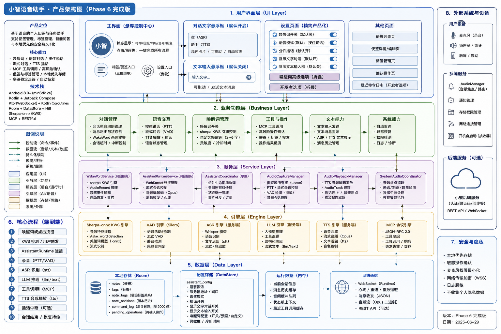

# Xiaohong Notes

[简体中文](README_zh.md)

Xiaohong Notes (`小泓便签`) is an Android note-taking app with an integrated Xiaozhi-compatible voice assistant. It combines everyday note management with voice, text, and wake-word interaction, allowing the assistant to find, create, organize, and update notes from the same interface.

Notes are stored on the device and remain usable without a network connection. Network access is required only for assistant activation and online conversations.

## Architecture



## Features

### Notes for everyday use

- Normal notes and todo notes
- Search, tags, colors, pinning, and list or grid layouts
- Archive, recently deleted items, restore, and permanent deletion
- Batch selection for pinning, archiving, restoring, deleting, and tagging
- Automatic updates across note lists, filters, and assistant actions
- Customizable home and navigation colors

### Built-in voice assistant

- Xiaozhi-compatible device activation and conversation service
- Push-to-talk and hands-free streaming conversation modes
- Optional text input and on-screen conversation transcript
- Voice control for notes, todos, tags, archive, search, and app navigation
- Automatic reconnection and recovery from interrupted audio sessions
- Optional interruption of TTS playback during streaming conversations

### Local wake word

- On-device keyword spotting powered by sherpa-onnx
- Preset wake words and custom 2-6 character Chinese wake words
- Pronunciation selection, model validation, and on-device testing before saving
- Foreground-service operation while the app is in the background or the screen is locked
- Automatic restoration after app restart or device reboot when wake-word listening is enabled
- Configurable sensitivity and repeat-trigger cooldown

### Confirmed and traceable actions

- Destructive or ambiguous assistant actions require explicit confirmation
- Pending confirmations survive process restarts and expire safely
- Revision snapshots are created before supported destructive changes
- Assistant operations are recorded in a bounded local command history
- Duplicate protocol requests are prevented from executing the same action twice

## Getting Started

Xiaohong Notes supports Android 8.0 (API 26) and later.

1. Build and install the app from source.
2. Create and organize notes directly from the home screen.
3. Tap the Xiaozhi button to activate the assistant. If a verification code is shown, complete the device authorization indicated by the app and tap the button again.
4. Grant microphone access when starting a voice conversation.
5. Enable wake-word listening from Settings when hands-free access is needed.

The default interaction mode is push-to-talk. Wake-word listening is disabled until the user enables it.

## Voice Interaction

The assistant button adapts to the current connection and conversation mode:

- **Push-to-talk:** hold the button to speak, then release to send.
- **Streaming conversation:** tap once to start a continuous conversation and tap again to stop.
- **Wake word:** say the configured phrase to start a streaming conversation while the foreground service is listening.
- **Text:** enable text input in Settings to send a message without using the microphone.

When an operation needs confirmation, the app shows a preview before applying the change. Confirmation can be completed in the app or through the active assistant conversation. The foreground notification never confirms an operation by itself.

## Privacy and Permissions

Note content, tags, revisions, confirmations, and command history are stored locally in the app database. Wake-word detection also runs locally on the device. Audio from an active assistant conversation is sent to the configured Xiaozhi-compatible service for speech processing and response generation.

| Permission | Purpose |
| --- | --- |
| Microphone | Voice conversations, wake-word detection, and custom wake-word testing |
| Notifications | Shows the required foreground-service notification while background wake-word listening is active |
| Foreground microphone service | Keeps user-enabled wake-word listening active in the background |
| Start on boot | Restores wake-word listening after a device restart when it was previously enabled |
| Network | Assistant activation, conversations, and tool exchange |

Microphone and notification permissions are requested when their corresponding features are enabled, not during ordinary note-taking.

## MCP Tools

The assistant exposes the following note application capabilities through MCP. High-risk calls return a confirmation request and do not change data until that request is approved.

### Notes

```text
notes.resolve
notes.search
notes.list_recent
notes.get
notes.create
notes.append
notes.delete
notes.update_title
notes.toggle_done
notes.convert_type
notes.pin
notes.replace_content
notes.restore_revision
notes.archive
notes.restore
notes.clear_done
notes.list_archived
notes.list_deleted
notes.list_todos
notes.list_done
notes.list_pinned
notes.list_by_tag
```

### Tags

```text
tags.search
tags.bind
tags.delete
tags.create
tags.rename
tags.list
```

### App navigation

```text
ui.open_note
ui.show_confirmation
ui.show_search
ui.show_note_list
ui.show_pinned
ui.show_tag
ui.show_archive
ui.show_trash
```

### Confirmations

```text
assistant.confirm
assistant.reject
assistant.list_pending_confirmations
```

## Build from Source

Requirements:

- Android Studio with Android SDK 35
- JDK 17
- An Android 8.0+ device or emulator

Clone the repository and build a debug APK:

```powershell
git clone https://github.com/ER1C-6832/note-assistant-android.git
cd note-assistant-android
./gradlew.bat :app:assembleDebug
```

On macOS or Linux, use `./gradlew` instead of `./gradlew.bat`.

Run the primary unit-test suites:

```powershell
./gradlew.bat :notes-domain:testDebugUnitTest :notes-data:testDebugUnitTest :assistant-mcp-base:testDebugUnitTest :assistant-tools:testDebugUnitTest :assistant-runtime:testDebugUnitTest :assistant-wakeword:testDebugUnitTest
```

## Technology

The application is written in Kotlin with Jetpack Compose and Material 3. It uses Room for local data, DataStore for preferences, Hilt for dependency injection, OkHttp for the Xiaozhi-compatible WebSocket connection, Android audio APIs and MediaCodec for voice transport, and sherpa-onnx for local keyword spotting.

## Documentation

- [Development plan](docs/DEVELOPMENT_PLAN.md)
- [Notes behavior specification](docs/spec/PHASE1_NOTES_SPEC.md)
- [Trust and traceability specification](docs/spec/PHASE2_TRUST_AND_TRACEABILITY_SPEC.md)
- [Assistant runtime specification](docs/spec/PHASE3_ASSISTANT_RUNTIME_SPEC.md)
- [MCP notes tools specification](docs/spec/PHASE4_MCP_NOTES_TOOLS_SPEC.md)
- [Wake-word specification](docs/spec/PHASE5_WAKEWORD_SPEC.md)

## Contributing

Issues and pull requests are welcome. For behavioral changes, include a concise description of the user-visible result and the relevant verification. Changes to assistant tools should preserve confirmation, revision, and command-history behavior for high-risk operations.

Before opening a pull request, build the affected modules and run their unit tests. Keep product documentation aligned with behavior exposed in the application.

## Acknowledgements

The voice runtime is compatible with the Xiaozhi protocol and draws on the companion [xiaozhi-android](https://github.com/ER1C-6832/xiaozhi-android) project. Local keyword spotting is powered by [sherpa-onnx](https://github.com/k2-fsa/sherpa-onnx).
