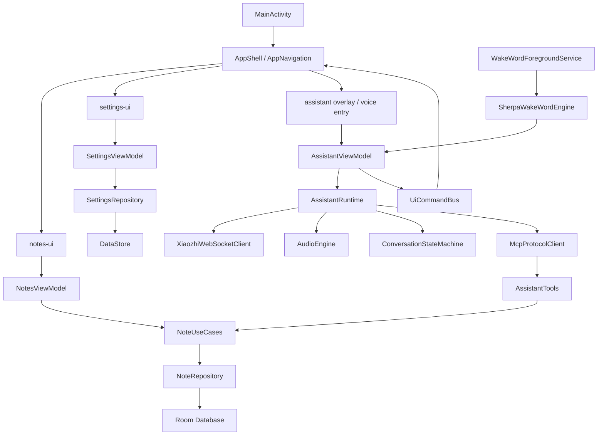

下面这份我会把两个建议整合成一份**正式开发大纲**。核心原则先放在最前面：

> **便签业务层是主轴。UI 手动操作、语音助手操作、后台唤醒词操作、未来通知/快捷入口操作，都必须走同一批 UseCase。**
> **语音助手只是输入方式和自动化能力，不是绕过业务层的特权通道。**

---

# 安卓端集成语音助手的便签 App 开发大纲

## 1. 项目名称建议

建议新项目命名为：

```text
note-assistant-android
```

中文产品名可以继续沿用：

```text
小智便签 / EHOME 便签 / 智能语音便签
```

工程定位不要叫 `xiaozhi-android-plus`，也不要叫 `assistant-notes`。因为产品主语应该是**便签**，不是语音助手。

---

## 2. GitHub 仓库建议

我建议：**新建独立仓库，不放进 PC 端仓库。**

推荐仓库：

```text
ER1C-6832/note-assistant-android
```

理由：

1. **Android 是独立产品线**
   PC 端是 PySide6 / QML / FastAPI / sidecar / SQLite；Android 是 Kotlin / Compose / Room / ForegroundService / sherpa-onnx。技术栈完全不同，放一起会让仓库结构越来越怪。

2. **构建系统完全不同**
   PC 端是 Python 生态，Android 是 Gradle / AGP / Kotlin / KSP / APK 签名 / Android Manifest / assets / jniLibs。混在一起会让 CI、依赖、发布流程都变复杂。

3. **Android 后续会有独立发布节奏**
   APK、测试机、权限兼容、唤醒词模型、版本号、crash 日志，这些都应独立管理。

4. **PC 端只是产品参考，不是安卓技术基座**
   PC 端保留为 `note-assistant-app` 没问题。Android 端新建仓库更干净。

最终建议：

```text
note-assistant-app            # PC 端便签 + sidecar demo / 产品参考
note-assistant-android        # 安卓端正式产品
xiaozhi-android               # 安卓语音助手核心 demo / 模块迁移参考
```

如果以后要做品牌级统一，可以再建一个 GitHub Organization 或 GitHub Project，把三个仓库统一管理，而不是强行放进一个 monorepo。

---

## 3. 项目背景

目前已有两个基础：

第一，PC 端便签 App 已经验证了一个重要产品方向：**便签 App 内嵌语音助手，语音可以操作便签**。PC 端已有分类、标签、置顶、多选、搜索、详情预览、语音状态展示等产品形态，可以作为 Android 端 UI 和功能参考。

第二，`xiaozhi-android` 已经验证了 Android 原生语音助手主链路。它已经覆盖 OTA / 激活、WebSocket、文本与语音交互、AudioRecord 上行、Opus 编解码、AudioTrack 播放、MCP、本地唤醒词、ForegroundService 等核心能力。仓库 README 里也明确说明它是一个完成的 Android assistant core demo，后续应作为产品 App 的可复用基线，而不是继续扩展成通用助手。

因此新项目不应该复刻 PC 的 sidecar，也不应该继续扩展 `xiaozhi-android` 的通用助手界面，而应该：

```text
以 Android 原生便签 App 为主体
+
抽取 xiaozhi-android 的语音助手内核
+
用便签专用 MCP tools 接入 notes / tags / todo 业务
+
通过 UseCase 保证所有操作统一入口
```

---

## 4. 终极目标

终极目标不是做一个“会记便签的语音助手”，而是做一个：

> **本地优先、可手动使用、可语音操作、可后台唤醒、可追溯、可撤销、可扩展的 Android 智能便签 App。**

最终形态应该具备这些能力：

```text
1. 不用语音时，它本身就是一个完整好用的便签 App。
2. 使用语音时，小智可以创建、搜索、修改、追加、置顶、完成、打开便签。
3. 语音操作不绕过业务层，和手动操作走同一批 UseCase。
4. 所有高风险语音操作有确认机制。
5. 所有语音修改有 revision 和 command log，可追溯、可恢复。
6. App 在后台时，可以通过唤醒词创建便签或操作便签。
7. 架构上便签业务、语音运行时、MCP 工具、UI 导航彼此解耦。
```

一句话：

> **Kotlin Compose + Room 的本地优先便签 App，复用 xiaozhi-android 的语音助手核心，通过便签专用 MCP tools 将语音能力收敛到 notes / tags / todo 操作。**

---

# 5. 技术栈路线

## 5.1 基础技术栈

```text
语言：
- Kotlin

UI：
- Jetpack Compose
- Material 3
- Navigation Compose

架构：
- MVVM
- Repository
- UseCase
- Domain-driven module boundary
- Hilt dependency injection

状态管理：
- ViewModel
- StateFlow
- SharedFlow
- Compose State

本地数据库：
- Room
- SQLite
- Room FTS

本地设置：
- DataStore Preferences
- 后续可按需升级 Proto DataStore

异步：
- Kotlin Coroutines
- Flow

依赖注入：
- Hilt
- KSP

网络：
- OkHttp WebSocket
- OkHttp HTTP client

音频：
- AudioRecord
- AudioTrack
- MediaCodec Opus encode/decode

后台唤醒：
- ForegroundService
- foregroundServiceType="microphone"
- sherpa-onnx KWS

语音助手：
- 从 xiaozhi-android 迁移 assistant-runtime / audio / network / protocol / mcp-base / wakeword / settings

工具协议：
- MCP JSON-RPC
- 只暴露 notes / tags / ui command 相关工具

测试：
- JUnit
- Turbine for Flow test
- Room in-memory database test
- Compose UI test
- MockWebServer for WebSocket / HTTP test
```

`xiaozhi-android` 当前已经具备 Compose、DataStore、Coroutines、OkHttp 等基础依赖，新项目需要补 Room、KSP、Hilt、Navigation Compose 等便签业务和工程化依赖。

---

## 5.2 第一版明确不做

```text
不做 QML
不做 Android sidecar
不做 HTTP localhost sidecar
不做 GraphQL
不做 gRPC
不做 Kotlin Multiplatform
不做复杂块编辑器
不做自研富文本引擎
不做云同步
不做通用系统助手
不迁移通用 Android MCP 工具
不做 PC / Android 联动
```

注意：不是这些技术永远不能做，而是**第一版不要做**。第一版目标是先把 Android 端“便签本体 + 语音操作便签”跑通。

---

# 6. 总体架构原则

## 6.1 最核心原则

```text
UI 手动操作
    -> Note UseCase
        -> NoteRepository
            -> Room

语音助手操作
    -> MCP Tool
        -> Note UseCase
            -> NoteRepository
                -> Room

后台唤醒词操作
    -> Assistant Runtime
        -> MCP Tool
            -> Note UseCase
                -> NoteRepository
                    -> Room
```

禁止：

```text
MCP Tool -> NoteDao
Assistant Runtime -> NoteDao
WakeWordService -> NoteDao
UI Screen -> NoteDao
```

所有写操作必须经过 UseCase。这样后续才能统一做：

```text
权限判断
风险分级
确认流程
Revision
CommandLog
撤销
UI 状态刷新
错误处理
```

---

## 6.2 推荐架构图



---

## 6.3 依赖方向

```text
app
  -> notes-ui
  -> notes-domain
  -> notes-data
  -> assistant-runtime
  -> assistant-tools
  -> assistant-wakeword
  -> app-settings
  -> core-common

notes-ui
  -> notes-domain
  -> core-common

notes-data
  -> notes-domain
  -> core-common

assistant-runtime
  -> assistant-mcp-base
  -> app-settings
  -> core-common

assistant-tools
  -> assistant-mcp-base
  -> notes-domain
  -> assistant-bridge
  -> core-common

assistant-bridge
  -> notes-domain
  -> core-common

assistant-wakeword
  -> app-settings
  -> assistant-runtime interface
  -> core-common

app-settings
  -> core-common
```

关键点：

```text
assistant-runtime 不依赖 notes-data
assistant-runtime 不认识 Room
assistant-tools 不直接操作 DAO
notes-domain 不依赖 Android UI
notes-data 不依赖 Compose
notes-ui 不依赖 Room Entity
```

---

# 7. 推荐仓库目录结构

建议用多 module Gradle 工程。

```text
note-assistant-android/
├── README.md
├── settings.gradle.kts
├── build.gradle.kts
├── gradle/
├── gradle.properties
├── .github/
│   └── workflows/
│       ├── android-ci.yml
│       └── lint.yml
│
├── app/
│   ├── build.gradle.kts
│   └── src/main/
│       ├── AndroidManifest.xml
│       ├── java/com/er1cmo/noteassistant/
│       │   ├── MainActivity.kt
│       │   ├── NoteAssistantApp.kt
│       │   ├── AppShell.kt
│       │   ├── AppNavigation.kt
│       │   ├── AppRoutes.kt
│       │   └── di/
│       │       ├── AppModule.kt
│       │       ├── DatabaseModule.kt
│       │       ├── RepositoryModule.kt
│       │       ├── UseCaseModule.kt
│       │       └── AssistantModule.kt
│       └── res/
│
├── core-common/
│   └── src/main/java/.../
│       ├── result/
│       │   ├── AppResult.kt
│       │   ├── AppError.kt
│       │   └── ErrorMapper.kt
│       ├── dispatchers/
│       │   ├── AppDispatchers.kt
│       │   └── DispatcherModule.kt
│       ├── time/
│       │   ├── TimeProvider.kt
│       │   └── SystemTimeProvider.kt
│       ├── logging/
│       │   ├── AppLogger.kt
│       │   └── LogSink.kt
│       └── json/
│           └── JsonProvider.kt
│
├── notes-domain/
│   └── src/main/java/.../
│       ├── model/
│       │   ├── Note.kt
│       │   ├── Tag.kt
│       │   ├── NoteType.kt
│       │   ├── NoteEditSource.kt
│       │   ├── NoteFilter.kt
│       │   ├── NoteSearchResult.kt
│       │   ├── NoteRevision.kt
│       │   └── AssistantCommandLog.kt
│       ├── repository/
│       │   └── NoteRepository.kt
│       ├── usecase/
│       │   ├── NoteUseCases.kt
│       │   ├── CreateNoteUseCase.kt
│       │   ├── UpdateNoteTitleUseCase.kt
│       │   ├── UpdateNoteContentUseCase.kt
│       │   ├── AppendNoteContentUseCase.kt
│       │   ├── DeleteNotesUseCase.kt
│       │   ├── RestoreDeletedNoteUseCase.kt
│       │   ├── PinNotesUseCase.kt
│       │   ├── ArchiveNotesUseCase.kt
│       │   ├── ToggleTodoModeUseCase.kt
│       │   ├── ToggleTodoDoneUseCase.kt
│       │   ├── SearchNotesUseCase.kt
│       │   ├── ListRecentNotesUseCase.kt
│       │   ├── CreateTagUseCase.kt
│       │   ├── RenameTagUseCase.kt
│       │   ├── DeleteTagUseCase.kt
│       │   ├── SearchTagsUseCase.kt
│       │   ├── BindTagsToNoteUseCase.kt
│       │   └── RestoreRevisionUseCase.kt
│       └── service/
│           ├── NoteCommandService.kt
│           └── NoteRiskPolicy.kt
│
├── notes-data/
│   └── src/main/java/.../
│       ├── db/
│       │   ├── NoteDatabase.kt
│       │   ├── NoteDao.kt
│       │   ├── TagDao.kt
│       │   ├── NoteTagDao.kt
│       │   ├── RevisionDao.kt
│       │   ├── SearchDao.kt
│       │   └── AssistantCommandLogDao.kt
│       ├── entity/
│       │   ├── NoteEntity.kt
│       │   ├── TagEntity.kt
│       │   ├── NoteTagCrossRefEntity.kt
│       │   ├── NoteRevisionEntity.kt
│       │   ├── NoteFtsEntity.kt
│       │   └── AssistantCommandLogEntity.kt
│       ├── mapper/
│       │   ├── NoteMapper.kt
│       │   ├── TagMapper.kt
│       │   └── RevisionMapper.kt
│       └── repository/
│           └── NoteRepositoryImpl.kt
│
├── notes-ui/
│   └── src/main/java/.../
│       ├── list/
│       │   ├── NoteListScreen.kt
│       │   ├── NoteListViewModel.kt
│       │   ├── NoteListState.kt
│       │   └── NoteListEvent.kt
│       ├── detail/
│       │   ├── NoteDetailScreen.kt
│       │   ├── NoteDetailViewModel.kt
│       │   └── NoteDetailState.kt
│       ├── editor/
│       │   ├── NoteEditorScreen.kt
│       │   ├── NoteEditorViewModel.kt
│       │   └── NoteEditorState.kt
│       ├── search/
│       │   ├── SearchScreen.kt
│       │   ├── SearchViewModel.kt
│       │   └── SearchState.kt
│       ├── tags/
│       │   ├── TagManagerScreen.kt
│       │   ├── TagManagerViewModel.kt
│       │   └── TagManagerState.kt
│       └── components/
│           ├── NoteCard.kt
│           ├── TodoCheckbox.kt
│           ├── TagChip.kt
│           ├── NoteActionBar.kt
│           ├── MultiSelectToolbar.kt
│           ├── AssistantStatusBar.kt
│           └── ConfirmActionSheet.kt
│
├── assistant-runtime/
│   └── src/main/java/.../
│       ├── controller/
│       │   ├── AssistantController.kt
│       │   ├── AssistantState.kt
│       │   └── AssistantEvent.kt
│       ├── conversation/
│       │   ├── ConversationStateMachine.kt
│       │   └── ConversationSession.kt
│       ├── network/
│       │   ├── XiaozhiWebSocketClient.kt
│       │   └── XiaozhiMessageBuilder.kt
│       ├── protocol/
│       │   ├── XiaozhiMessageRouter.kt
│       │   ├── ProtocolEvent.kt
│       │   └── McpProtocolClient.kt
│       ├── audio/
│       │   ├── AudioEngine.kt
│       │   ├── AudioRecorder.kt
│       │   ├── AudioPlayer.kt
│       │   ├── OpusEncoder.kt
│       │   ├── OpusDecoder.kt
│       │   ├── TtsPlayer.kt
│       │   └── VadController.kt
│       └── activation/
│           ├── OtaActivationClient.kt
│           └── DeviceIdentityManager.kt
│
├── assistant-mcp-base/
│   └── src/main/java/.../
│       ├── McpServer.kt
│       ├── McpTool.kt
│       ├── McpToolRegistry.kt
│       ├── McpToolResult.kt
│       ├── McpRiskLevel.kt
│       └── McpConfirmation.kt
│
├── assistant-tools/
│   └── src/main/java/.../
│       ├── NoteToolRegistry.kt
│       ├── notes/
│       │   ├── NotesCreateTool.kt
│       │   ├── NotesSearchTool.kt
│       │   ├── NotesListRecentTool.kt
│       │   ├── NotesOpenTool.kt
│       │   ├── NotesAppendTool.kt
│       │   ├── NotesUpdateTitleTool.kt
│       │   ├── NotesReplaceContentTool.kt
│       │   ├── NotesToggleDoneTool.kt
│       │   ├── NotesPinTool.kt
│       │   ├── NotesArchiveTool.kt
│       │   └── NotesDeleteTool.kt
│       ├── tags/
│       │   ├── TagsCreateTool.kt
│       │   ├── TagsSearchTool.kt
│       │   ├── TagsRenameTool.kt
│       │   ├── TagsDeleteTool.kt
│       │   └── TagsBindTool.kt
│       └── ui/
│           ├── UiOpenNoteTool.kt
│           ├── UiShowSearchTool.kt
│           └── UiShowConfirmationTool.kt
│
├── assistant-bridge/
│   └── src/main/java/.../
│       ├── UiCommandBus.kt
│       ├── UiCommand.kt
│       ├── PendingConfirmationStore.kt
│       ├── AssistantCommandLogger.kt
│       └── AssistantNoteContext.kt
│
├── assistant-wakeword/
│   └── src/main/java/.../
│       ├── WakeWordForegroundService.kt
│       ├── SherpaWakeWordEngine.kt
│       ├── SherpaWakeWordDetector.kt
│       ├── WakeWordConfig.kt
│       ├── WakeWordPreset.kt
│       └── WakeWordSettings.kt
│
└── app-settings/
    └── src/main/java/.../
        ├── SettingsRepository.kt
        ├── VoiceSettings.kt
        ├── WakeWordSettings.kt
        ├── AssistantSettings.kt
        ├── NotesSettings.kt
        └── DataStoreKeys.kt
```

---

# 8. 数据库设计建议

第一版数据库不要做复杂块编辑，但要把未来扩展点留好。

## 8.1 notes 表

建议使用 `Long` 自增 ID，除非你未来明确需要跨端同步。第一版本地优先，用 Long 更简单。

```text
notes
- id: Long
- title: String
- content: String
- type: String               # normal / todo
- content_format: String     # plain / markdown
- is_done: Boolean
- done_at: Long?
- pinned: Boolean
- archived: Boolean
- deleted: Boolean
- archived_at: Long?
- deleted_at: Long?
- color: String?
- reminder_at: Long?
- sort_order: Long?
- created_at: Long
- updated_at: Long
- last_edited_source: String # manual / voice / import / system
- source_conversation_id: String?
```

说明：

```text
type = normal 时：普通便签
type = todo 时：待办便签

is_done 只对 todo 有意义
done_at 记录完成时间
deleted 是软删除
deleted_at 用于最近删除 / 定期清理
content_format 第一版固定 plain，后续可升级 markdown
source_conversation_id 用于追溯语音创建或修改来源
```

---

## 8.2 tags 表

```text
tags
- id: Long
- name: String
- normalized_name: String
- color: String?
- created_at: Long
- updated_at: Long
```

约束建议：

```text
normalized_name 唯一
name 可展示原始大小写或中文
删除 tag 不删除便签，只解除关联
```

---

## 8.3 note_tag_cross_ref 表

```text
note_tag_cross_ref
- note_id: Long
- tag_id: Long
- created_at: Long
```

主键：

```text
(note_id, tag_id)
```

---

## 8.4 note_revisions 表

```text
note_revisions
- id: Long
- note_id: Long
- title_snapshot: String
- content_snapshot: String
- tags_snapshot_json: String
- type_snapshot: String
- is_done_snapshot: Boolean
- pinned_snapshot: Boolean
- archived_snapshot: Boolean
- created_at: Long
- source: String              # manual / voice / import / system
- reason: String?
- command_log_id: Long?
```

触发时机：

```text
更新标题前
覆盖正文前
追加正文前，可按策略记录
删除前
批量修改前
语音操作修改前
恢复 revision 前
```

第一版可以只展示“最近版本”，后续再做完整版本列表。

---

## 8.5 assistant_command_log 表

```text
assistant_command_log
- id: Long
- conversation_id: String?
- user_text: String?
- recognized_text: String?
- normalized_intent: String?
- tool_name: String
- arguments_json: String
- risk_level: String           # low / medium / high
- confirmation_status: String  # not_required / pending / confirmed / rejected / expired
- result_json: String?
- affected_note_ids_json: String?
- status: String               # success / failed / blocked / requires_confirmation
- error_message: String?
- created_at: Long
```

这个表非常重要，它不是“调试附属品”，而是语音助手可信度的一部分。

---

## 8.6 notes_fts 表

第一版搜索建议组合：

```text
Room FTS
+
LIKE fallback
+
tag join
+
静态词表扩展
```

FTS 表：

```text
notes_fts
- note_id
- title
- content
- tags_text
```

搜索策略：

```text
1. query 先做 normalize
2. 静态词表扩展同义词
   例如：
   待办 / 任务 / todo / 要做
   客户 / 客人 / 甲方
   报价 / 价格 / quote
3. FTS 搜索标题、正文、标签
4. LIKE fallback 兜底中文短词
5. 按命中位置和更新时间排序
```

排序建议：

```text
置顶优先
标题命中优先
标签命中其次
正文命中再次
未删除优先
未归档优先
更新时间倒序
```

---

# 9. 便签业务功能范围

## 9.1 Note CRUD

第一版必须完整：

```text
新建便签
编辑标题
编辑正文
追加正文
删除便签
批量删除
软删除
恢复删除
归档 / 取消归档
置顶 / 取消置顶
恢复最近版本
```

## 9.2 Todo 能力

每条便签都可以是普通便签或待办便签。

普通便签：

```text
标题
正文
标签
颜色
更新时间
```

待办便签：

```text
checkbox
标题
正文
标签
完成状态
完成时间
```

UI 行为：

```text
未完成：
[ ] 买牛奶

已完成：
[✓] 买牛奶
标题删除线
正文降低透明度
默认可隐藏已完成
```

UseCase：

```text
ToggleTodoModeUseCase
ToggleTodoDoneUseCase
ListTodoNotesUseCase
ListDoneNotesUseCase
```

---

## 9.3 Tag CRUD

必须完整支持：

```text
新增 tag
重命名 tag
删除 tag
搜索 tag
给便签添加 tag
从便签移除 tag
按 tag 筛选便签
批量给便签添加 tag
批量移除 tag
```

删除 tag 属于高风险操作，需要确认。

---

## 9.4 搜索与筛选

搜索范围：

```text
标题
正文
标签
创建时间
更新时间
待办状态
完成状态
置顶状态
归档状态
```

筛选入口：

```text
全部
待办
已完成
置顶
归档
最近删除
指定 tag
语音创建
最近编辑
```

---

# 10. UI 页面建议

## 10.1 首页 / 列表页

结构：

```text
顶部：
- 搜索框
- 设置入口
- 语音状态小胶囊

筛选区：
- 全部
- 待办
- 已完成
- 置顶
- 标签

主体：
- NoteCard 列表

底部：
- 新建按钮
- 语音按钮
```

NoteCard 内容：

```text
checkbox，可选
标题
正文摘要
tag chips
更新时间
置顶标记
语音来源标记，可选
```

长按进入多选模式：

```text
多选删除
多选归档
多选置顶
批量加 tag
批量取消 tag
```

---

## 10.2 编辑页

```text
标题输入
待办开关 / checkbox
tag 选择
正文编辑
保存状态
历史版本入口
语音助手小入口
```

第一版正文就是多行 `TextField`。不要做块编辑器。

---

## 10.3 搜索页

```text
搜索输入
最近搜索
搜索建议
标签快捷筛选
结果列表
命中高亮，后续可做
```

---

## 10.4 Tag 管理页

```text
tag 列表
新建 tag
重命名 tag
删除 tag
查看该 tag 下便签
```

---

## 10.5 设置页

语音助手设置：

```text
语音助手开关
WebSocket / OTA 配置
激活状态
文本对话测试
语音模式
TTS 播放设置
```

唤醒词设置：

```text
唤醒词开关
唤醒词预设
灵敏度
冷却时间
通知权限
麦克风权限
误触发标记
命中次数统计
```

数据设置：

```text
导出 Markdown，后续
导出数据库，后续
清理已删除
清理 command log
```

调试设置：

```text
WebSocket 状态
最近工具调用
本地日志
MCP tools/list 预览
模拟 tools/call
```

---

# 11. 语音助手集成方案

## 11.1 全局入口

保留三个入口：

```text
1. 主界面底部 / 右下角语音按钮
2. 设置页语音助手配置
3. ForegroundService 后台唤醒词
```

前台流程：

```text
点击语音按钮
-> AssistantController.startListening()
-> WebSocket 连接 / 激活
-> AudioEngine 开始上行
-> 服务端 ASR / LLM
-> MCP tools/call
-> Note UseCase
-> UI 更新
```

后台流程：

```text
用户喊“小智小智”
-> WakeWordForegroundService 检测
-> AssistantController 激活
-> WebSocket 连接
-> 流式聆听
-> tools/call
-> Note UseCase
-> Room 更新
-> 通知 / 回到 App 后展示结果
```

`xiaozhi-android` 当前架构里已经有 `WakeWordForegroundService -> SherpaWakeWordEngine -> SherpaWakeWordDetector` 的链路，上传的架构文档也展示了唤醒词通过 Broadcast 回到 AppNavigation / ViewModel 再进入 WebSocket + AudioEngine 的流程。

---

## 11.2 迁移模块

从 `xiaozhi-android` 迁移：

```text
audio/
network/
protocol/
data/ota/
data/identity/
wakeword/
mcp 协议基础
ConversationStateMachine
WakeWordForegroundService
Settings 中语音配置逻辑
```

不迁移：

```text
现有 MainScreen
现有 Assistant Orb 主界面
通用 Android MCP tools
通用工具卡片 UI
旧 Phase 文档
大量调试文案
```

`xiaozhi-android` README 里列出的关键源码区域包括 `audio/`、`core/`、`data/`、`domain/`、`mcp/`、`network/`、`protocol/`、`ui/`、`wakeword/`，其中除了 UI 主界面，大多数都可以作为迁移参考。

---

# 12. MCP 工具设计

第一版工具要比简单 demo 完善，但仍然收敛在便签业务内。

## 12.1 风险等级

低风险，直接执行：

```text
notes.search
notes.list_recent
notes.get
tags.search
ui.open_note
ui.show_search
```

中风险，执行后提供撤销或反馈：

```text
notes.create
notes.append
notes.update_title
notes.toggle_done
notes.pin
notes.archive
tags.create
tags.bind
```

高风险，必须 confirmed=true：

```text
notes.delete
notes.batch_delete
notes.replace_content
notes.batch_update_tags
notes.clear_done
tags.delete
tags.rename，当影响大量历史语义时
```

---

## 12.2 notes.create

创建便签。

```json
{
  "title": "明天下午三点开会",
  "content": "地点待定",
  "tags": ["工作"],
  "type": "todo",
  "pinned": false
}
```

返回：

```json
{
  "status": "success",
  "note_id": 123,
  "message": "已创建待办便签：明天下午三点开会"
}
```

---

## 12.3 notes.search

搜索便签。

```json
{
  "query": "开会",
  "tags": ["工作"],
  "include_done": false,
  "include_archived": false,
  "limit": 10
}
```

返回：

```json
{
  "status": "success",
  "results": [
    {
      "note_id": 123,
      "title": "明天下午三点开会",
      "snippet": "地点待定",
      "tags": ["工作"],
      "updated_at": 1720000000
    }
  ]
}
```

---

## 12.4 notes.list_recent

```json
{
  "limit": 10,
  "include_deleted": false
}
```

用于处理：

```text
“打开刚才那条”
“把刚才那条标记完成”
“最近记了什么”
```

---

## 12.5 notes.open

不直接操作 Activity，只发 UI command。

```json
{
  "note_id": 123
}
```

内部链路：

```text
NotesOpenTool
-> UiCommandBus.emit(OpenNote(123))
-> AppNavigation 收到
-> NoteDetailScreen(123)
```

---

## 12.6 notes.append

追加内容，优先推荐。

```json
{
  "note_id": 123,
  "content": "补充：记得带电脑"
}
```

适合语音命令：

```text
“给刚才那条补充一句……”
“在客户样品寄送里加上快递单号……”
```

---

## 12.7 notes.update_title

只改标题，风险中等。

```json
{
  "note_id": 123,
  "title": "客户样品寄送"
}
```

---

## 12.8 notes.replace_content

覆盖正文，高风险，必须确认。

```json
{
  "note_id": 123,
  "content": "新的完整正文",
  "confirmed": false
}
```

未确认返回：

```json
{
  "status": "requires_confirmation",
  "message": "这会覆盖原正文，是否确认？",
  "preview": {
    "old_content": "旧正文摘要",
    "new_content": "新正文摘要"
  }
}
```

---

## 12.9 notes.toggle_done

```json
{
  "note_id": 123,
  "done": true
}
```

---

## 12.10 notes.pin

```json
{
  "note_id": 123,
  "pinned": true
}
```

---

## 12.11 notes.archive

```json
{
  "note_ids": [123, 456],
  "archived": true
}
```

批量归档可以设为中风险；如果数量过多则升级为高风险。

---

## 12.12 notes.delete

软删除，高风险。

```json
{
  "note_ids": [123, 456],
  "confirmed": true
}
```

未确认返回：

```json
{
  "status": "requires_confirmation",
  "message": "将删除 2 条便签，是否确认？",
  "preview": [
    {
      "note_id": 123,
      "title": "客户样品寄送"
    }
  ]
}
```

---

## 12.13 notes.restore

恢复最近删除。

```json
{
  "note_ids": [123]
}
```

---

## 12.14 notes.restore_revision

恢复版本，高风险或中高风险。

```json
{
  "note_id": 123,
  "revision_id": 888,
  "confirmed": true
}
```

---

## 12.15 tags.create

```json
{
  "name": "客户",
  "color": "#AABBCC"
}
```

---

## 12.16 tags.search

```json
{
  "query": "客户",
  "limit": 10
}
```

---

## 12.17 tags.rename

```json
{
  "tag_id": 1,
  "name": "客户跟进",
  "confirmed": true
}
```

---

## 12.18 tags.delete

高风险，必须确认。

```json
{
  "tag_id": 1,
  "confirmed": true
}
```

说明：

```text
删除 tag 只解除标签，不删除便签。
```

---

## 12.19 tags.bind

```json
{
  "note_id": 123,
  "tags": ["客户", "待办"],
  "mode": "add"
}
```

mode：

```text
add
remove
replace
```

`replace` 风险更高，建议要求确认。

---

## 12.20 ui.show_confirmation

用于把语音确认转成 App 内确认底板。

```json
{
  "confirmation_id": "abc123",
  "title": "确认删除便签",
  "message": "将删除 6 条今天的待办，是否确认？"
}
```

---

# 13. 语音确认与撤销层

建议新增：

```text
PendingConfirmationStore
```

它负责保存待确认操作。

流程：

```text
用户：“删除今天所有已完成待办”
-> notes.clear_done
-> RiskPolicy 判断 high
-> 返回 requires_confirmation
-> PendingConfirmationStore 保存 action
-> UiCommandBus 弹出确认底板
-> 用户点击确认 / 语音说确认
-> 重新调用 tool，confirmed=true
-> UseCase 执行
-> 写 revision
-> 写 command log
```

中风险操作执行后建议 Snackbar：

```text
已创建便签「客户样品寄送」  撤销
```

这比单纯语音播报更可靠。

---

# 14. 权限策略

权限申请不要在 App 第一次启动时一股脑弹出。

推荐顺序：

```text
首次启动：
- 不申请麦克风
- 不申请通知
- 让用户先使用便签

用户点击语音按钮：
- 解释语音需要麦克风
- 申请 RECORD_AUDIO

用户开启后台唤醒词：
- 解释需要前台服务和常驻通知
- Android 13+ 申请 POST_NOTIFICATIONS
- 启动 microphone foreground service
```

`xiaozhi-android` 当前已经声明了 `INTERNET`、`RECORD_AUDIO`、`FOREGROUND_SERVICE`、`FOREGROUND_SERVICE_MICROPHONE`、`POST_NOTIFICATIONS`，并且唤醒词服务使用了 `foregroundServiceType="microphone"`，这条技术路线可以沿用。

---

# 15. 分阶段落地计划

## Phase 0：新仓库和工程骨架

目标：建立正式 Android 工程，不接语音。

范围：

```text
创建 note-assistant-android 仓库
创建 Android Studio 工程
配置 Kotlin / Compose / Material3
配置 Hilt / KSP
配置 Room
配置 DataStore
配置 Navigation Compose
配置 core-common
配置 CI
```

验收：

```text
App 可运行
首页空状态正常
Hilt 正常注入
Room 可初始化
DataStore 可读写
基础导航可跳转
```

---

## Phase 1：纯便签 MVP

目标：完全不用语音，也能作为便签 App 使用。

范围：

```text
notes 表
tags 表
note_tag_cross_ref 表
NoteRepository
NoteUseCases
首页列表
新建便签
编辑便签
删除便签
置顶
待办 checkbox
tag 创建 / 绑定 / 删除
搜索
多选删除
```

验收：

```text
可新建普通便签
可新建待办便签
可编辑标题和正文
可添加和移除标签
可按标签筛选
可搜索标题 / 正文 / 标签
可置顶
可软删除
可恢复最近删除
```

---

## Phase 2：业务层收口与可追溯

目标：让业务层适合接语音。

范围：

```text
note_revisions
assistant_command_log
NoteCommandService
RiskPolicy
UiCommandBus
PendingConfirmationStore
本地模拟 tools/call 页面
```

验收：

```text
所有 UI 写操作都经过 UseCase
修改便签前会生成 revision
删除便签前会生成 revision
本地模拟 notes.create 可创建便签
本地模拟 notes.search 可搜索便签
本地模拟 notes.delete 未确认时返回 requires_confirmation
确认后才删除
command log 可查看
```

---

## Phase 3：迁移语音助手主链路

目标：把 `xiaozhi-android` 的语音核心迁入新工程，但暂时不操作便签。

范围：

```text
DeviceIdentityManager
OtaActivationClient
XiaozhiWebSocketClient
XiaozhiMessageRouter
ConversationStateMachine
AudioEngine
OpusEncoder
OpusDecoder
TtsPlayer
McpProtocolClient
AssistantController
AssistantSettings
```

验收：

```text
可 OTA / 激活
可连接 WebSocket
可文本对话
可按住说话
可播放 TTS
可断线重连
可在设置页查看连接状态
```

---

## Phase 4：便签 MCP tools 接入

目标：语音可以真正操作便签。

范围：

```text
notes.create
notes.search
notes.list_recent
notes.open
notes.append
notes.update_title
notes.toggle_done
notes.pin
notes.delete
tags.create
tags.search
tags.bind
tags.delete
```

验收语句：

```text
“小智，帮我记一下明天上午十点联系客户”
“小智，帮我创建一个待办，周五寄出样品”
“小智，搜索客户相关的便签”
“小智，打开刚才那条便签”
“小智，给刚才那条补充一句，快递单号待同步”
“小智，把刚才那条标记完成”
“小智，把客户样品寄送置顶”
“小智，删除刚才那条便签”
```

验收标准：

```text
低风险直接执行
中风险执行后可撤销
高风险必须确认
所有语音操作写 command log
所有修改类操作写 revision
UI 能自动刷新
```

---

## Phase 5：后台唤醒词

目标：App 不在前台时也能唤醒并创建便签。

范围：

```text
sherpa-onnx KWS 模型迁移
WakeWordForegroundService
WakeWordSettings
唤醒词预设
灵敏度
冷却时间
通知权限
麦克风权限
后台唤醒后进入流式聆听
```

验收：

```text
开启唤醒词后通知栏常驻
切到桌面后喊“小智小智”
App 能进入聆听
可以后台创建便签
回到 App 后便签已经存在
误触发可标记
命中次数可统计
```

---

## Phase 6：产品打磨

目标：从技术可用变成产品可用。

范围：

```text
首页体验优化
编辑器体验优化
搜索体验优化
语音状态展示
确认底板
撤销 Snackbar
错误提示
空状态
权限说明页
设置页整理
日志导出
崩溃兜底
性能优化
```

验收：

```text
普通用户不用看调试信息也能使用
语音状态清晰
失败原因可理解
高风险操作不会误执行
便签列表滚动流畅
Room 查询稳定
后台唤醒不会明显耗电异常
```

---

## Phase 7：后续扩展，非第一版

```text
Markdown 导出
数据库导出
图片便签
录音便签
提醒通知
桌面快捷方式
分享文本到便签
OCR 导入
云同步
PC / Android 同步
更复杂的 Markdown 预览
多设备身份体系
```

---

# 16. 最终架构判断

最终你这个 Android App 应该收口成下面这句话：

> **一个 Kotlin Compose + Room 的本地优先便签 App，以 UseCase 作为唯一业务入口；手动 UI、语音助手、后台唤醒词、MCP tools 全部通过同一批 UseCase 操作 notes / tags / todo；xiaozhi-android 只作为 assistant-runtime 能力来源，不把通用系统助手复杂度带进便签产品。**

仓库上建议：

```text
新建 ER1C-6832/note-assistant-android
```

PC 端仓库继续保留为产品参考和历史 demo；`xiaozhi-android` 冻结为语音助手核心参考。Android 便签 App 从第一天就按正式产品仓库做，不放进 `note-assistant-app/android-build`。
